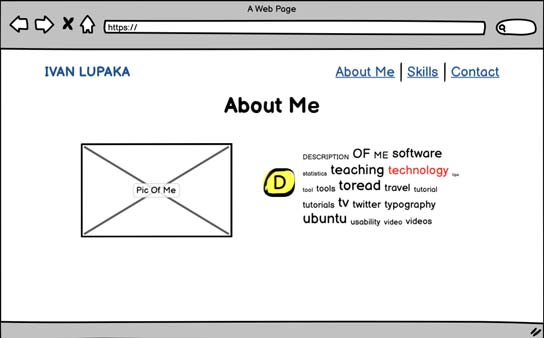
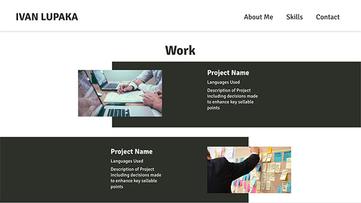
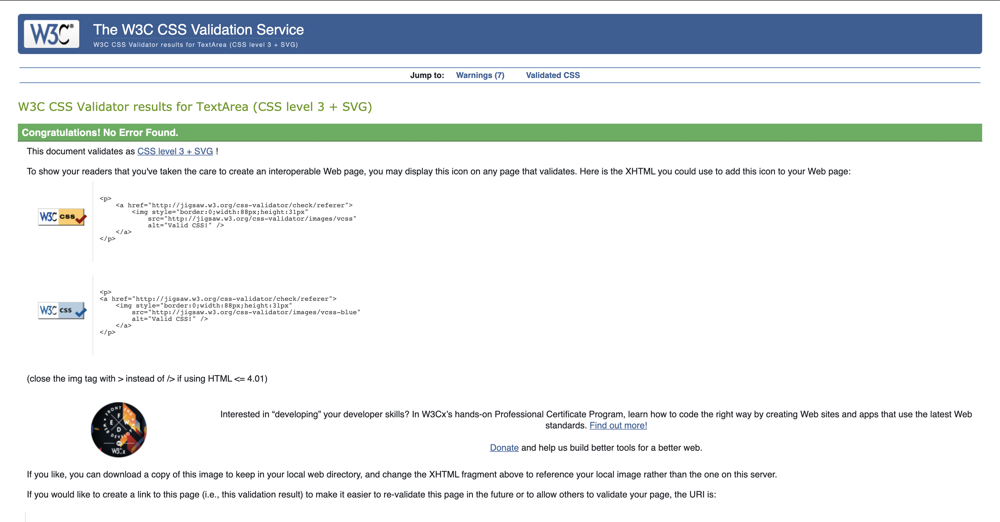

# My Portfolio

This is a portfolio website, providing an online accessible go-to space for recruiters, peers & future professional connections.
A showcase of my skills as a developer, to look into my experience & to review the specifics of my work.

### Table Of Content

1. [Project Goals](#project-goals)
2. [Targer Audience](#target-audience)
3. [User Stories](#user-stories)
   - User Story Analysis
4. [Design Choices](#design-choices)
   - Font
   - Color
   - Shapes & Lines
   - General Feel
   - Design Wrap-Up
5. [Wireframes](#wireframes)
   - Balsamiq
   - Adobe XD
6. [Key Features](#key-features)
   - Off-Canvas Menu for mobile viewports.
   - Animated X button on nav menu
   - Sticky pull down nav bar
   - Hover effects on buttons
   - Animation on arrow icon
   - Icon usage in skills section
   - Responsively sizing elements
   - Desktop viewport specific styling, taking advantage of space.
   - Hero Section
7. [Features Left Out](#features-left-out)
8. [Technologies Used](#technologies-used)
9. [Testing](#testing)
   - Responsiveness
   - Automated
   - User Story
   - Peer
10. [Known Issues and Problems Encountered](#known-issues-and-problems-encountered)
11. [Deployment](#deployment)
12. [Acknowledgements](#acknowledgements)

### Project Goals

Everything in & on the portfoliio is there to make the owner more interesting and make the reader more curious.
Relevent information concerning who the owner is, what they can offer, how well they can offer that service, availablity and location.
This will feed the requirements of the reader while the overall look, intuitiveness and functionality of the actual site will
showcase the owner’s personality from a professional standpoint. This will all go to completing the main goals of the site which are:

- Create interest in owner as developer to increase job opportunities
- Provide an easy access all in one space for professionally interested parties to find out more about the owner.
- Showcase lastest and greatest work/projects.

### Target Audience

- An agency recruiter
- A specific company recruiter/Headhunter
- A recently met/networked industry peer
- A potential freelance client
- Friends & family looking to offer out my services.

### User Stories

#### Owner:

- Present self as a skilled & reliable developer to get work.
- Offer easy access to previous work to showcase skills.
- Offer a compelling red thread to the contact section to get the most value from the site.
- Show personality as a developer to give readers a better understanding of meself from a professional standpoint.
- Site should be able to be viewed on any device to maximise interest from all potential perspectives.

#### User:

- To find out if owner has required skillset for vacancy so they can be offered job.
- To find out if owner would fit in office atmosphere & workflow so they can be offered job.
- To see if portfolio is being updated which would indicate continuous learning and curiousity.
- To see if owner would have interesting enough projects so that they could be recommended for a job.
- To see if owner has made sites like the one I want so I can ask them to make something similar.
- To see if owners work is worth the money that they are charging so I can ask for discounts.
- To easily showcase owners skills in making websites and apps so they can be seen as a good and trusted developer in more circles.

### User Story Analysis

From defining the user stories, goals and objectives of the site were settled. By breaking down each story, we are able to see how each user wants to
complete an action to get some sort of outcome or value of benefit to them. By separating these outcomes/benefits, we can see that the goals of the
websites begin to relate to the user/owner outcomes/benefits. Factoring in what we percieved to be user & owner wants & needs, decisions were made on
what would provide the most value & worth. This in turn then fed the site & feature specific requirements that were developed. These include:

- Easy access to a projects section.
- Easy access to contact information.
- An about me that included both formal/professional and informal personality traits.
- Need for the site to be regularly updated with new interesting projects.
- Simplicity & a cohesive experience.
- A footprint of the owners personality should be left in the overall look of the site.

### Design Choices

Armed with this information, further extensive research was done to best understand what and how the best online portfolio’s look like and function.
Focusing on font choice, color usage, use of shapes and lines & general feel (links to this research found in acknowledgements).

#### Font

With font choice, it was important that the chosen typeface was contemporary, easy to read & familiar but still different.
Looking at sites from the brands all over the world over the last few years, there has been a shift to more soft modern fonts and I wanted to take advantage
of this shift to hopefully make the reader have some familiarity with the font type of the brands and sites they visit often and mine. I also wanted the
font to be easy on the eye, to be easy to read for as many people as possible and be simple enough but with a small unique edge to it.
The chosen font was “Signika” which was found on Google Fonts. The font is a typical signage typeface and actually inspired by fonts such as
Ronnia, Meta, and Tahoma. The benefit being that it is easy to read with gentle curvatures and perfect for providing clarity of information.
I also made the choice to only use one font throughout the website to continue building this feeling of familiarity with the user.
The back up font is Sans Serif.

#### Color

Colors were chosen based on personal preference, improving accessibility & providing purpose. My own personal preference are earthy and muted/pastel colors.
In the final palette I also wanted to include colors that had enough contrast between them to make sure readability would not be an issue. There also needed
to be colors to give purpose to elements e.g. green for links, blue to highlight or provide contrast.

The final color palette chosen was:

The black and white colors are both not pure black and white, they were chosen this was to take away from the harshness of the pure black and
white colors and also to add more elements of softness in tune with the general palette scheme. The blue and green were chosen for purpose and
preference with both of them being soft and mellow continuing the general theme of the palette. All the colors together provide enough flexibility and
contrast between them to allow for ideal readability. The soft and mellow characteristics of all the colors also offer a calming space for the information
to live in, not adding to any potential cognitive overload. The font and color come together to guide the reader through the website smoothly, simply and
with as little stress as possible.

#### Shapes & Lines

The use of curved corners is a common theme throughout the website & the thought behind this was to reduce overall sharpness and add to the soft theme of
the site in general. There was a thought to use lines in the background of the site to fill what could be seen as too much empty white space but this was a
feature deemed not necesarry (will be discussed more in the features section).

#### General feel

As you may have gathered from earlier reading, the design, look and feel of the site was guided by thoughts of softness, ease, mellowness, muted colors
and clarity. The design choices reflect these concepts and aim to show them all in the best light. Specifics will again be covered more in the
features section.

#### Design Wrap Up

Armed with relevent research of what a good portfolio should look like, the site specific requirements and a clear a design concept, the wireframes were
then drawn out to provide a baseline for the look and structure of the site.

### Wireframes

I used Balsamiq at this stage to assist in the creation of the wireframes
for each section of the site. After creating the initial structure with Balsamiq,
I then used Adobe XD to add color and other styling to create an identical version of the site to code from.  
Below I include wireframe images from both Balsamiq and XD and feature descriptions to go with them.

#### Mobile View Home Section

A - An early decision was made to have a clear hero section as the starting point of the site. The purpose of this section was to draw attention to the focus of the site, with the text stating who I am and what I do, immediately providing the reader with relative information. I also decided that I wanted this hero element to be neighboured by smaller relevent elements such as some sort of availability and a link to further information.

B – The title/logo element I thought should be clean and simple. The purpose is to confirm what the reader assumes to be my own portfolio so seeing my name in a place where most sites would put a brand adds to the familiarity of the site. It also will provide a link back to this home/hero section.

C – The site needed to be responsive in all viewports so for smaller screens there will be a vertical off-canvas nav menu which will hide away when not needed and slide out from the left when this button is pressed. The button also turns into an X when the menu is open. More info to come on the menu later.

D – I thought it could be good to call on more familiarity and use the now common green available dot which would call on the readers internet savy to quickly understand this is a sign of availability. The temptation was to include an animation on the dot to add some interactivity to the page and potentially a link to the contact section, but I thought this would lead to the user wanting to actually interact with the dot where there is no link and if there was a link, it could be premature to link straight to the contact page from the hero. The comprimise was to include a button (which is not included in the wireframe) just below this availability element with a link to current work/projects. The thought being that most readers would want to see evidence of work before trying to contact me as the site owner.

E – This is a small but important element which can be clicked (is also animated on hover on desktop) to take you down to the next section without having to scroll. It is common practice in web design to give a hint to what is further down a page from a sites homepage to show the reader there is more content. The downward bouncing animation of this arrow icon also tries to feed the thought of more content to the reader.

On this section, I added the blue to the hero box (later changed to a lighter blue for readability). The text was given the black color apart from the middle line as I wanted to emphasise this. This box is also where I first showcase the what will be common rounded corners aesthetic.

The whole nav/title section also has a slight shadow which was not replicated in the final version.

The work button link is given a green color which is also another pattern to be followed which is button links being given a green color. The vertical line and arrow icon serve their respective purpose without the need for any added styling.

#### Mobile View About Section

F – The title of the next section (and following sections) is meant to be as simple as possible and do only what it should do, indicate the beginning of a new section. The text will be larger and bold to differenciate between normal text as is done in general web formatting.

G, H & I – I wanted the about me section to just make sense, be concise and easy to take information from. Therefore the parts of this section were broken up into expected smaller sections and structured in a way that is very logical. The picture is closely followed by a brief description of myself which is then followed by 2 lists floated on the left and right of the page with a vertical line between (not in wireframe) for differenciation.

For the about section, I decided to use a dark barckground on with white colored text to provide some freshness in the flow of the page. There is a good amount of contrast between the black background and the white text. The list styling was removed in the final version of the site and the text was aligned to the left and right respectively to allow for vidual separation.

#### Mobile View Skills Section

J – The skills section also follows the same thought process of being broken up into smaller sections and having a logical structure. I utilised relevant icons to reinforce the ideas of each mini section in the readers mind.

Front End has a desktop which is the main viewport for many people and goes hand in hand with the thought of what the user sees. Back End has a server, another common thought when thinking about back-end development. The tools section has a wrench, again a common tool.

Underneath each icon is the title of each mini section followed by a similar side by side list separated by a vertical line (not in wireframe) and each section (apart from the last one) is separated by a horizontal line.

The skills section has color added to the icons to highlight the draw attention to them and highlight their relevance in each row. For each row section, the titles are in a larger font and bold which draws attention to them giving the ideal flow of information to the reader.

#### Mobile View Work Section

K – The work section employs a now familiar structural concept to the about me section. An eye-catching picture is followed by the name of the project, the tech/languages used and a brief description of the project. This is really giving the user the most relevant information in the most easy and accessible manner. There is also a visit button (not in wireframe) which takes the reader to the actual project site and will open in a new tab. The familiarity of the structure of the site would hopefully be within the reader by now which would make the whole experience of going through the site, much more cohesive and enjoyable.

The work section was intended to have a similar structure to the about section with regards to the darker background. At this point I thought it might be good to use a lighter background from the about section but I later decided against this in favour of keeping consistent styling throughout the site. The darker background also was separated from the image in the final site due to the difficulty of having it halfway up the picture and making it work responsively.

#### Mobile View Contact Section

L, M & N – The contact section is broken up into two mini sections. I wanted to again give easy access to relevant information so the first section is simply a phone number and email address. I also thought it wise to include a contact form to give the reader the opportunity to easy send a message/email to me straight from the site. This is catering to different potential users and makes this section a little more accessible by not forcing the opening of another page/app to contact me.

The contact section is pretty much as it is in the balsamiq wireframe but in the final site, I decided against having a blue container for the contact form and kept a white background. The thought behind this being that I wanted to keep the clean look of the website with color serving purpose and not just for the sake of it. A blue container for the contact form just was not necessary & does not marjorly increase the useability of the contact form for this screen size.

#### Mobile View Footer Section

O – The footer provides links to instagram where a user can go to have a more personal view of myself, my linkedin for a professional showcase and my github to check out more of my work. This section is outlined by a simple horizontal line with a bit of top margin after any former section.

The footer was kept the same as it serves its purpose well enough as it was.

#### Mobile View Nav Section

P – The open navigation menu is meant to be clean and work as expected. The page section links are in big font and well separated, the position of the X and the functionality of the menu (mmenu.js plug-in) means that the user can press the X or just click anyway outside the menu element to go close it and go back to the main site.

Q – This would have been a good feature to have but there was an issue which will be talked about in the “features to add/bugs” section.

The off canvas nav was given a dark background and white text and spaced out section links for ease of use. The main page is also pushed to the side and dimmed out. The dimmed whole visible dimmed out section of the page works as a back button which closes the nav menu and returns you to the main site view.

#### Desktop View Home Section

A – The logo/title stays the same, just responively sizes.

B – The menu is not needed to be off-canvas so there now a sticky horizontal nav bar which includes the logo/title.

C – The hero section also responsively sizes to the larger viewport.

This section retains the structural differences mentioned earlier for the desktop view and keeps the colors also mentioned earlier. In the final version the horizontal line between the work button and the arrow icon is also there.

#### Desktop View About Section

D & E – The structure of the about me section changes to be more horizontaly based to take advantage of the extra screen real estate. The picture is in the same row as the description keeping a structural familiarity. The trait list also responsively sizes but not to the extent seen in the wireframe compared to the final look.

In this section I decided to reduce the overall size of it compared to this mock up. There is a large black colored container where a smaller image and the descriptive text sit parallel to each other. Just below that you have the trait list headings followed by the trait lists themselves. This part was made smaller so as to keep all of the about information on one “page” and make it as easily digestible as possible.

#### Desktop View Skills Section

F – The skills section has been also adjusted to have a horizontal structure with each mini srction laid out in a row separated by vertical lines. This showcases all important info in an easily taken in format, on one “page”.

This section also retains the structure of the balsamiq wireframe and the color of the mobile mock up shown earlier.

#### Desktop View Work Section

G – The work/projects section also receives the horizontal structural changes, with each mini section having a picture flanked by textual description and a horizontal line separating each row. They are also mirrored so in the row, the picture will be on right and in the second, the picture is on the left. This adds to the visual separation of each row and mini-section.

The work section has some more obvious styling differences. There is a horizontal black container which starts underneath half of the picture and extends all the way to the right with white colored descriptive text still parallel to the image. This is then mirrored for the next project row with the image to the right and the black colored container stretching to the left of the viewport.

I thought this would be a different take on the familiar black background & white text styling throughout the page. Doing this in the projects section also gives the readers interested in my work a bit more to look at compared to the rest of the site.

#### Desktop View Contact Section

H – The contact section is split into two to really emphasise the differing contact methods. To the left are the phone and email details and the right is a full contact form. The viewport width means this would be an expected layout and is an effective use of the page space.

The contact form also keeps the same structure as the original wireframe but adds the blue and black background colors for the “lets talk” and “leave a message” sections respectively. With the text being white, readability is not an issue and the form input elements are also white providing a good amount of contrast.

#### Desktop View Footer Section

I – The footer is much the same with it only responsively sizing to take more width and the social media icons becoming larger.

The footer again maintains its simplicity in structure and styling.

### Key Features

#### Off-Canvas Menu

I really wanted to use a nav menu that was not the default bootstrap one as I wanted something a bit more elegant and with the possibility to have a footer. After a lot of research, I came across this mmenu.js javascript plug-in that seemed to provide everything I was looking for. The difficulties in making the footer links work will be outlined in the “features left out” section. The options this plug in provided included sliding in from the right, tabbed menu’s, pre-pended headers & full screen menu’s for native app like navigation. Though very interesting, I decided to go with a simple & clean looking nav menu for this site.

#### Animated X in “open” state off canvas menu

The mmenu.js plug-in also offered the use of hamburger.js as an add-on to the main plug-in. This add-on allowed for the iinclusion of animated burger icons in the menu with a few different choices up for grabs. I decided to go with a unique twisting animation since the actual burger icon is so common these days, I thought it wise to have some differenciation where possible.

#### Sticky pull down nav bar

Another add-on related to mmenu.js is the sticky nav add-on which allows for the nav bar (in my case the logo/title and menu burger icon) to be hidden when scrolling down but made visible when scrolling up. This is a great feature for useability as hiding the nav when not in use really gives full immersion to the reader to all the content of the site and when they need to access the nav bar, it is only a swipe away.

#### Hover effects on buttons

The hover effects on the buttons give an important interactivity to the function of the button. It confirms or indicates that something will happen if you click this. The only frustration with this being the lack of hover effects for touch displays but research in this topic is something I will be doing soon.

#### Animation on arrow icon

The thought to have an animation on this icon was something that just made sense and is also something that I have seen a lot of great websites do. The downward pointing motion indicates the availability of more content and it is also clickable which takes the reader straight to the next section.

#### Icon usage in skills section

Using icons in this section made sense as mentioned earlier, they provide points of relation to the reader and increases the feeling of familiarity.

#### Responsively sizing elements

All the elements included in the site should be visible, accessible and interactable from any viewport. The responsiveness of the site was tested and tested again, all the elements will adjust responsively to different device viewports. This is important for many reasons but in the case for the website goals, it is so important that anyone, anywhere can access this site and access the content with ease and in the way I as the developer intended them to.

#### Desktop viewport specific styling, taking advantage of space.

When I was adjusting the structure of the site for larger device viewports I realised I needed to take advantage of the extra screen space in a cohesive, efficient and stylish way. This was an interesting challenge and one that I believe has resulted in a site that looks great in all device viewports.

The downside being that I did not decide on the structural differences from a code point of view, it was purely from a design point of view with the aim of reaching the site goals. This meant that certain changes required a lot of code re-working and repeating which might not be the ideal workflow in the future. Armed with this knowledge though, that mistake will be learned from.

#### Hero Section

A hero section is a very common and almost classic way to welcome readers to a site. A Focused portion of the site with the most important information and often links to further content or information. My usage of a hero section allowed me to really serve the site requirements and goals in giving the reader easy to access information and keeping it simple.

### Features left out

#### Nav footer with socials

There was a lot of difficulty just getting the mmenu.js plug-in to fuction properly. The footer section seemed to work but the icon links were not being directed to the proper href. After hours of research and troubleshooting, I gave up on this feature in order to secure the rest of the priorities when building the site. This is potentially something to come back to once I have more javascript knowledge.

#### Constantly animated green available dot

There was a thought to have this dot intermittently animate to add the the interctivity of the page. I did not go through with this idea as I thought it would lead readers to believe it could be a link, potentially adding to their cognitive overload. I had a second thought believing that maybe I could turn it into a link to the contact section, but I also did not implement this idea as I did not want to put off potential recruiters by offering contact information where the first priority would be looking at my work (hence why there is a “my work” link in the hero).

#### Further background styling

There were fears that the site was too simple looking and could do with some more background styling with shapes or lines of some sort. I decided against this more because of my own design or lack of design skills when it comes to using shapes and lines to compliment this type of site. This is something that could be implemented at a later stage though.

#### Half background container in work section mobile view

As mentioned earlier, I attempted to style the projects section so that the picture would at its halfway point (height-wise) have a black background which would overlap into the following textual description elements. I could not get this styling to work responsively as I wanted so I left it to focus on other features. It is another feature that can be implemented at a later date.

#### Back to top button

There was a late thought to add a back to top button to the website, but this was proving difficult to implement. I then decided this could be a future feature to be added as I wanted to prioritise my time better and focus on getting the site working fully and efficiently.

### Technologies Used

Bootstrap Documentation:
https://getbootstrap.com/docs/4.5/getting-started/introduction/

mmenu.js nav plug in:
https://mmenujs.com/docs/

mmenu.js mburger animated burger icon:
https://mmenujs.com/mburger/docs.html

mhead sticky header plug-in:
https://mmenujs.com/mhead/docs.html

hover.js for animated arrow icon:
https://github.com/IanLunn/Hover/blob/master/README.md#hovercss

Font awesome icons:
https://fontawesome.com/

Balsamiq documentation:
https://balsamiq.com/wireframes/desktop/docs/

### Testing

#### Responsiveness

Testing for responsiveness was carried out through chrome dev tools, [responsive design checker](https://www.responsivedesignchecker.com/) & [Am I responsive](http://ami.responsivedesign.is/). Emulating 30 viewport sizes, the website worked as intended in each one. Specific element and structural changes are mentioned above in the features section, detailing the thinking behind the responsiveness of the site.

#### Automated Testing

I used various automated online tests to check various components of the sites inner workings.

#### HTML & CSS validation check

This check allows you to upload, link or directly input your html and css code to be scored based on syntax errors, missing or incorrect characters & more. The results are given in a list of priority in what needs to be fixed and what is not so important.

I used the direct input function and pasted my html and css code into the calidators input form. The returned errors for HTML included small sytax errors and an incorrectly nested div. For CSS there were some unused styles that could be removed and some clashing styles in media queries to be solved. After going through these errors, I ended up with a “no errors or warnings message” which means the code was fully validated.

#### UPTRENDS

I then used the uptrends website speed test which prompts you to enter a website URL, choose a device screen size & bandwidth throttle setting and browser. It then checks the google pagespeed score, load speed, file size and requests and more. It then suggests color coded prioritized performance improvements based on its findings.

For my website, the desktop viewports mostly gave me a pagespeed score above 90 which is good. On mobile viewports the score was not as good, the pagespeed score fluctuated between 65 and 75. The important part of this test though are the recommended performance improvements,

- for my site in both mobile and desktop viewports, it was suggested that I size images better taking into account the image size at largest viewports and using that as the actual image size for the images served to make savings in file size.

- It also suggested that I eliminate render blocking resources which block the first paint of the sute, saying instead to consider using inline javascript or css styles. This means that the external css stylesheets such as bootstrap, font-icon and others needed to be loaded before the rest of the site which caused a general slowing down of the load time. This was a suggestion that will be taken into account for future use as it is not necessary for this project.

- It was also suggested that I remove unused CSS rules which would also reduce overall file size of the site. For my site it was suggested I remove the font-awesome and bootstrap rules that I was not using. Again this is a suggestion that I will be following in the future but will not be taking into account for this project.

#### WEB.DEV

This test is based on lighthouse, which is tests performance, best practice, SEO and accessibility and is run on a simulated mobile device on a fast 3g network. Similar to the uptrends test, it then suggests color coded improvements to be made to optimize your site. My site got decent best practice and SEO scores and lower performance score but a very good accessibility score. The suggested improvements were the same as the uptrend test apart from the addition of a suggestion to serve images in next gen formats. These formats include JPEG 200, JPEG XR or WebP. They offer better compression than png or JPEG therefore reducing file download time and data consumption. This is a suggestion that will be taken on board.

#### User Story Testing

- Present self as a skilled & reliable developer to get work.
  The owner feels the site showcass their skills and experience well enough to be considered a good candidate for software development jobs.

- Offer easy access to previous work to showcase skills.
  The owner is happy that the work/projects section is available at one click from the home/hero page.

- Offer a compelling red thread to the contact section to get the most value from the site.
  The owner is pleased that the site has a good content flow and gives the right information at the right time to make sure readers are not over/under exposed by the time they get to the contact section.

- Show personality as a developer to give readers a better understanding of meself from a professional standpoint.
  The owner feels that the site includes enough personal touches to give an indication of their personality as a developer.

- Site should be able to be viewed on any device to maximise interest from all potential perspectives.
  The recruiter is pleased to be able to check this portfolio on the go and not have to worry about missing out on any content.

- To find out if owner has required skillset for vacancy so they can be offered job.
  The headhunter is satisfied that the portfolio contains relevant content regarding the owner’s specific skillset and is able to take further interest in the owner.

- To find out if owner would fit in office atmosphere & workflow so they can be offered job.
  The HR Manager is happy to read about the owners personality traits and likes that the site does not look generic, so is interested in getting to know the owner more.

- To see if portfolio is being updated which would indicate continuous learning and curiousity.
  The HR manager taking a second look at the portfolio is impressed that the owner has some fresh projects that seem interesting and sees this as a good sign for future promotion prospects.

- To see if owner would have interesting enough projects so that they could be recommended for a job.
  The newly met/freshly networked peer sees that the owner has been working on some really cool projects and would be more inclined to recommend them for a relevant job.

- To see if owner has made sites like the one I want so I can ask them to make something similar.
  The bar owner looking for a new website now trusts that the owner is profficient at creating websites and has seen one that they can reference and use that as a base to customise their ideas on.

- To see if owners work is worth the money that they are charging so I can ask for discounts.
  The restaurant owner who is tight with money sees that the quality of the owners work is worth what they are charging and so is not likely to ask for discounts.

- To easily showcase owners skills in making websites and apps so they can be seen as a good and trusted developer in more circles.
  The family member who proud of the owners work shows their friends the portfolio and remarks that the owner is available for anyone who needs a website or app.

#### Peer testing

I asked two people who are familiar with we development for their opinions on the site. Both appreciated the general look and structure of the site and were happy that the simplicity of it went well hand in hand with the purpose of the site, being a portfolio. A suggestion was that I increase the brightness of the hero section background to a lighter blue in order to increase readability and contrast. This was taken on board and changed in the final version of the site.

### Known Issues and Problems Encountered

- I found the mmenu.js plug-in difficult to work with at first but then seemed to figure it out eventually. The one problem that persists is the lack of working links when including a footer in the slide out menu. The links could not be directed to the intended URL correctly. This is something that could be fixed in the future with more research.

- Due to the utilisation of bootstrap as the main layout tool for this project, I constantly questioned myself on where and when exactly to use rows and columns and when not to. When it came to positioning of specific elements, this was especially a test. I ended up using it to give the basis of the structure and then used specific CSS positioning to get elements where I wanted them to be. In the future I plan on making more of a plan with how much bootstrap I want to use to not run into these same issues.

- During the design process of the site, I started with the mobile view and did not functionally relate the desktop structural design, I created the design based on ideals based on the look of the site. This meant that when it came to writing the markup, in quite a few places I had to repeat sections to create the desktop view that I wanted (screenshot). In the future I will make sure to think from a more functional point of view when it comes to designing the structure for desktop viewports and relate it to the flow of the HTML markup to not run into the same problems.

- One of the major issues I had during the early and late development phase of the website was the appearance of dead white space either side of the main body content container. This eventually was found to be caused by defining height for certain elements unnecesarilly and defining larger width’s than necessary. After fixing these specific rules in my stylesheet, the site worked flawlessly from this point of view. It was a good lesson learned and one that I will remember as I do not want to end up with those issues again.

### Deployment

The site was developed on GitPod and was used the Code Institute template to have the correct plug in set up on GitPod. The repository was linked to my github account through my GitPod log-in. I would use Git to commit and push changes to the master branch and eventually push the site to a GitHub Pages site where it would be hosted and made live and available. This process was as follows:

- Connect to GitPod through GitHub.
- Open the Code Institute Gitpod template on GitHub.
- Click on the use this template button.
- Provide relevant details for to be made repository.
- The repository will then be cloned and opened on GitPod as a workspace.
- At the end of a day of coding I would use Git to check the status, add changes, commit changes and eventually push changes.
- Once the site was fully developed, I would access the repository from GitHub.
- Click on the settings tab and scroll down to the GitHub Pages section.
- Click on the source option and change it to master and save this change.
- The page would refresh and a link would then be provided to the site, fully running and hosted on GitHub Pages.

#### To run this project locally, you can:

- Go to the repository on GitHub.
- Click on the code button.
- Copy the URL shown in the clone option.
- Open Git Bash
- Decide where you want the cloned directory to be and make that your current working direcory.
- Type git `clone` and paste in the copied URL
- Press enter and your clone will now be created.

### Credits

#### CONTENT
All of design, content and code (unless specified) were all created by myself. 

Specified code usage includes:
- Bootstrap 4 Navbar
- Bootstrap 4 Form
- Bootstrap 4 Buttons
- Hover.js css animation
- Font-awesome icon `<i>` tags
- Emmet HTML boilerplate
- Mmenu.js (mburger.js & mhead.js add-ons included) 
- Cssgradient.io generated color gradient

#### MEDIA
Photos in this site were gathered from unsplash.com, specifically after a search of code.

Project 1 photo: Blake Connally, https://unsplash.com/photos/B3l0g6HLxr8
Project 2 photo: Fotis Fotopoulos, https://unsplash.com/photos/LJ9KY8pIH3E
Project 3 photo: Christopher Gower, https://unsplash.com/photos/m_HRfLhgABo

This site was used for research on user stories:
https://stormotion.io/blog/how-to-write-a-good-user-story-with-examples-templates/

#### ACKNOWLEDGEMENTS
These sites were used for design inspiration:

https://onepagelove.com/

https://dev.to/jatinrao/20-developer-portfolios-for-inspiration-2k06

https://www.awwwards.com/

Stack Overflow was a constant aid when troubleshooting and though no specific code was directly copied, ideas and learnings were taken in order to make my site function the way I intended it to.

